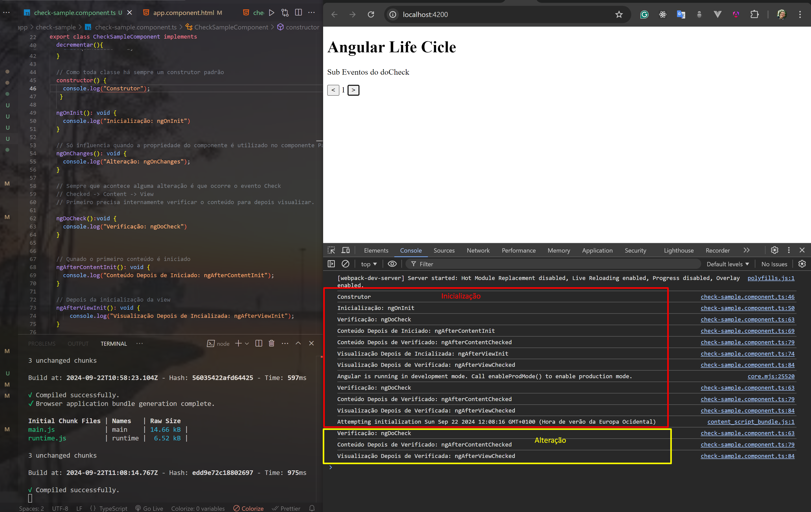

# Subeventos do Hook: DoCheck

 Quando acontece alguma alteração primeiro é verificado, depois o conteúdo é analisado internamente e por último a visualização.

 Checked -> Content -> View

## Na Inicialização (Chamada dos métodos): 
1. Construtor
2. Inicialização: **ngOnInit**
3. Verificação: **ngDoCheck**
4. Conteúdo Depois de Iniciado: **ngAfterContentInit**
5. Conteúdo Depois de Verificado: **ngAfterContentChecked**
6. Visualização Depois de Incializada: **ngAfterViewInit**
7. Visualização Depois de Verificada: **ngAfterViewChecked**
8. Verificação: **ngDoCheck**
9. Conteúdo Depois de Verificado: **ngAfterContentChecked**
10. Visualização Depois de Verificada: **ngAfterViewChecked**
    
## Na Alteração (Chamada dos métodos): 
1. Verificação: **ngDoCheck**
2. Conteúdo Depois de Verificado: **ngAfterContentChecked**
3. Visualização Depois de Verificada: **ngAfterViewChecked**

