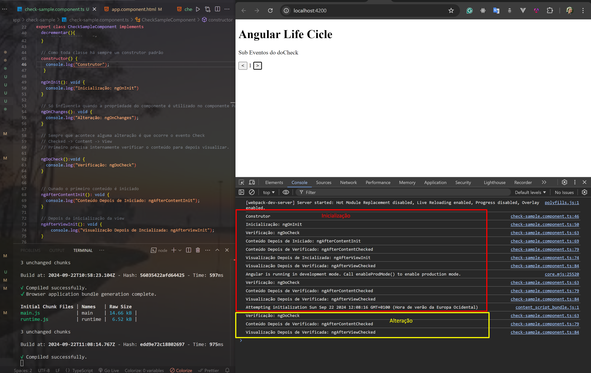

# Angular: Hooks(Ganchos) do Ciclo de Vida
No Angular um componente tem um ciclo de vida que começa quando o componente é instanciado e continua verificando qualquer alteração até a que o componente não se torna mais necessário.


## Subeventos do Hook: DoCheck

<p> Quando acontece alguma alteração primeiro é verificado, depois o conteúdo é analisado internamente e por último a visualização.</p>

 Init -> Checked -> Content -> View<br>
 Checked -> Content -> View


### Na Inicialização (Chamada dos métodos): 
1. Construtor
2. Inicialização: **ngOnInit**
3. Verificação: **ngDoCheck**
4. Conteúdo Depois de Iniciado: **ngAfterContentInit**
5. Conteúdo Depois de Verificado: **ngAfterContentChecked**
6. Visualização Depois de Incializada: **ngAfterViewInit**
7. Visualização Depois de Verificada: **ngAfterViewChecked**
8. Verificação: **ngDoCheck**
9. Conteúdo Depois de Verificado: **ngAfterContentChecked**
10. Visualização Depois de Verificada: **ngAfterViewChecked**
    
### Na Alteração (Chamada dos métodos): 
1. Verificação: **ngDoCheck**
2. Conteúdo Depois de Verificado: **ngAfterContentChecked**
3. Visualização Depois de Verificada: **ngAfterViewChecked**



## OnDestroy
Quando um componente não necessita estar ativo ou em execiução, é melhor destruir para evitar vazamentos de memória ([Memory Leak](https://wscld.medium.com/memory-leak-no-angular-0049675367db#:~:text=Vazamentos%20de%20mem%C3%B3ria%20no%20Angular,%2C%20potencialmente%2C%20falhas%20na%20aplica%C3%A7%C3%A3o.)), que ocorre quando muitos componentes carregados, porém poucos sendo utilizados ou ativos.

Chama-se a interface OnDestroy e implementa o método ngOnDestoy.

````
  import { OnDestroy } from '@angular/core';

  class LifeCycleHooks implements OnDestroy{
    ...
    ngOnDestroy(): void {}
  }
````

## Reference
[Dio.me: Curso LifeCyle Hooks Angular - Formação Angular](https://web.dio.me/course/631a4bdc-6090-4c60-b982-c3096626c783/learning/5a5421bf-b160-4b7a-b23f-03188b1d9991?back=/track/formacao-angular-developer&tab=undefined&moduleId=undefined)
